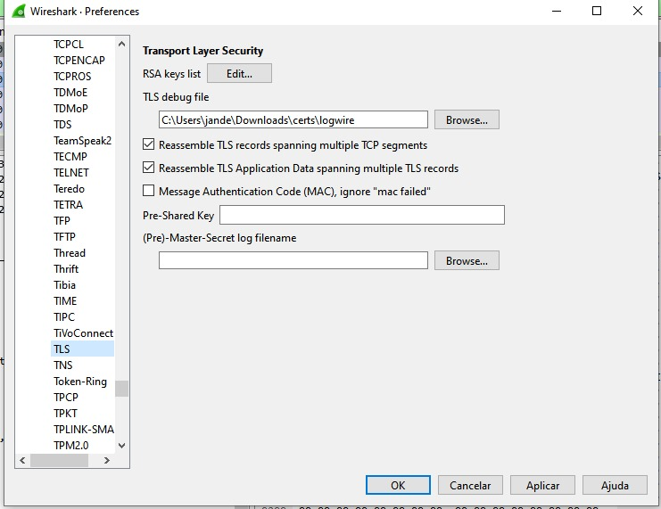
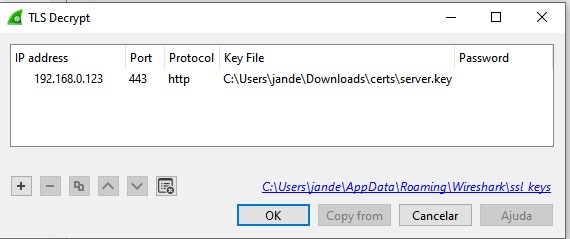
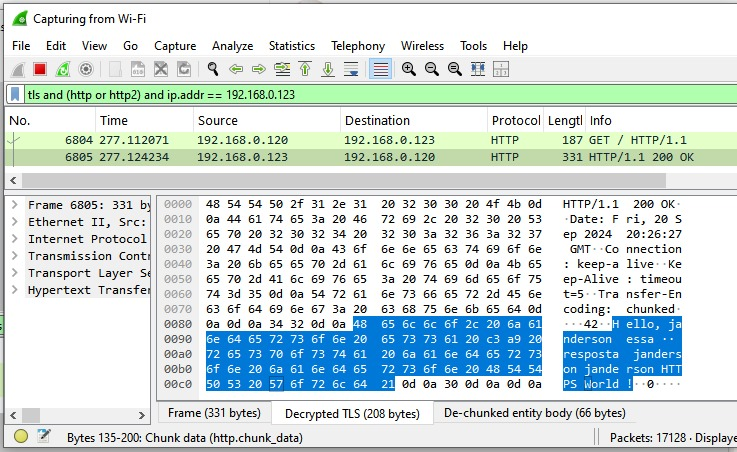
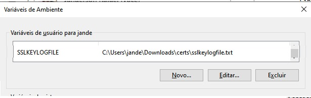
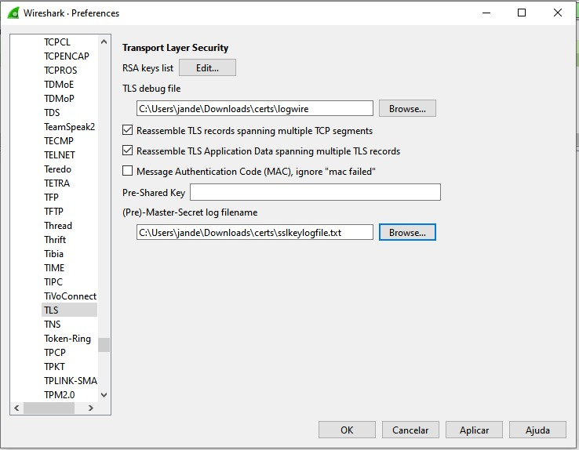

# Material referencia
https://akshitb.medium.com/how-to-run-https-on-localhost-a-step-by-step-guide-c61fde893771

# Funcionamento servidor
Servidor express node utilizando chaves publica server.crt e chave privada server.key para escutar na porta https 443
- usar comando node server.js para subir e acessar em https://localhost

# Configuracao express
## Força utilizar tls 1.2
- secureProtocol: "TLSv1_2_method",
## Força servidor a aceitar e utilizar cifras mais fracas que permitem a descriptografia
- ciphers: 'AES256-SHA256:AES256-SHA:AES128-SHA256:AES128-SHA:RC4-SHA:RC4-MD5:DES-CBC3-SHA',
- honorCipherOrder: true 

# wireshark
Presentes no menu edit > preferences > protocols > tls , existem duas formas de descritografar ssl conteudo https. 
- RSA key list: nessa opção podemos utilizar uma chave privada do certificado do server (server.key) para decriptografar o conteudo http.`Importante essa opção funciona somente quando voce possui acesso a chave privada do server, quando o server esta com certificado usando algoritmo rsa e quando o server aceita conexoes tls 1.2 que nao tem PFS habilitado`. Campo "RSA key list"
- Pre-master secret: metodo que utiliza um arquivo gerado pelo browser que armazena no caminho da variavel SSLKEYLOGFILE as chaves de sessao (pre-master-secret) durante o estabelecimento da comunicacao. Campo  "Pre-Master-Secret log filename". O TLS 1.3 introduziu o conceito de Perfect Forward Secrecy (PFS), o que significa que a chave de sessão é gerada durante o handshake e não pode ser derivada da chave privada. Portanto, sem o arquivo SSLKEYLOGFILE, você não conseguirá descriptografar o tráfego TLS 1.3 apenas com a chave privada.

# Pontos importantes
- Trafego tls 1.3 nao funcionara com metodo rsa key list, apenas com pre-master-secret, porém se a sua requisicao http nao sai do browser entao sera dificil fazer isso
- No caso de nao possuir o certificado privado para usar metodo RSA key list ou o trafego nao sair do browser e nao conseguir usar pre-master secret, pode ir para a abordagem de configurar um proxy para intermediar os request.
- Faça as chamadas com terminal ou navegador guia anonima, pois aba normal do chrome eu notei que somente nas primeiras requests ele consegue descriptografar, apos restartar wireshark ele nao pega as proximas requests, pelo que entendi pode ser devido a um cache de sessao
- Quando wireshark descriptografa o conteudo ele cria uma nova linha na listagem com protocolo http

# Conceito do wireshark e de proxy
wireshark é um ferramenta de sniffing de rede que captura o trafego transitado.
Proxy é uma outra ferramenta que podemos indicar para o nosso adaptador de rede ou aplicacao forcar que as requisicoes passem por ele antes de serem direcionadas para o destino, nessa abordagem de proxy o request ao inves de ser criptografado com o certificado do servidor destino ele vai ser primeiramente criptografado com o certificado do proxy aonde podemos intermediar a chamada e abrir o conteudo antes de seguir o encaminhamento para o servidor de destino, onde somente nesse ponto sera encriptado com a chave do servidor.

# Chaves certificado
Para gerar chave publica e privada por ser usado openssl

# Teste lendo trafego https com RSA key list (tls 1.2)
- Inicie a aplicacao com `node server.js``
- Configure chave privada no wireshark

- Realize requisição com guia anonima ou terminal, forcando tls 1.2, Exemplo: curl `https://192.168.0.123 -k --tlsv1.2`
- Filtre o trafego no wireshark por `tls and (http or http2) and ip.addr == 192.168.0.123`

- Selecione o request no wireshark e clique na aba `Decrypted TLS`

# Teste lendo trafego https com Pre-master secret (tls 1.3)
- Inicie a aplicacao com `node server.js`
- Configure variável windows para browser salvar arquivo de log

- Feche o browser completamente e abra novamente, verifique se o caminho do arquivo foi criado e esta recebendo conteudo
- Configure Pre-master secret no wireshark

- Realize requisição com guia normal ou terminal,  Exemplo: curl `https://192.168.0.123 -k`
- Filtre o trafego no wireshark por `tls and (http or http2) and ip.addr == 192.168.0.123`

- Selecione o request no wireshark e clique na aba `Decrypted TLS`

