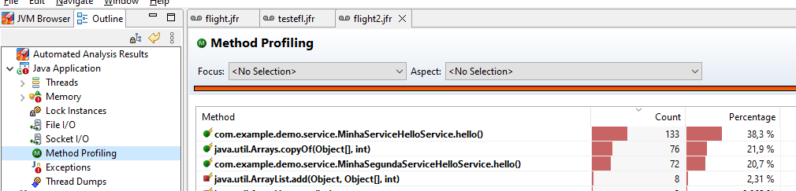
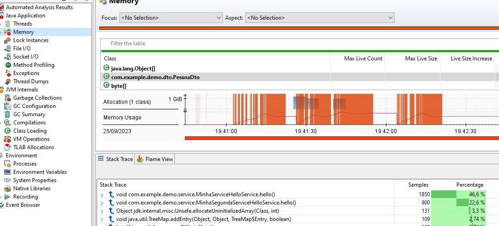

# Glowroot
Site: https://glowroot.org/
Download and unzip glowroot-0.14.0-dist.zip, add -javaagent:path/to/glowroot.jar to your application's JVM args, point your browser to http://localhost:4000, and see all
Esse profile extremamente simples proporciona uma visão simples por endpoint de controller, o que ajuda a mapear mais facilmente problemas no endpoint x. 

Também é possivel ter uma nocao dos metodos com maior tempo dentro do endpoint basta ir em Transactions > selecionar a request > aba Slow traces > Selecionar no grafico ponto de requisicao desejado Clicar em profile ou clicar em view flame graph. 
Caso queira ter uma visao geral é só ir na aba Thread Profile e filtrar pelo pacote do projeto, exemplo com.example.demo.*

# Jconsole
Pesa muito na aplicacao, recomendado usar local ou em teste.
JConsole fornece monitoramento básico do tempo de execução da JVM junto com recursos importantes como CPU, memória e threads. Consiste em várias guias que resumem a integridade da memória JVM, threads, classes, máquina virtual e MBeans que são expostos por meio do console JMX padrão. O JConsole pode ser anexado dinamicamente a qualquer JVM e coletará dados desde que a ferramenta esteja aberta e conectada à JVM. É bastante bom para inspecionar a mecânica de uma JVM em alto nível, para que você possa identificar problemas como possíveis vazamentos de memória, alta simultaneidade de threads e impasses. O visualizador MBean também permite ao usuário relatar centenas de métricas de KPI em tempo real para verificar quais recursos da JVM estão sendo esgotados pela aplicação. Infelizmente, a Oracle recomenda que o JConsole seja implantado apenas em ambientes de desenvolvimento e teste devido à sobrecarga que pode introduzir no aplicativo. A UI é simples e fácil de navegar, mas carece de contexto de aplicação em relação às solicitações e transações do usuário que são executadas na JVM. Por exemplo, se um usuário reclamar que sua transação de checkout está lenta, o usuário do JConsole não terá como correlacionar ou solucionar problemas dessa atividade.

# Jvisualvm
recomendado usar local ou em teste.
VisualVM também é gratuito e vem com o Java SDK. É um pouco como o JConsole, mas com melhor batom e recursos de monitoramento mais avançados. O VisualVM leva o monitoramento de aplicativos um nível mais profundo do que o JConsole, permitindo que o usuário analise a execução do thread, bem como a capacidade de traçar o perfil do uso de CPU e memória de solicitações JVM, ambas acionadas manualmente pelo usuário. VisualVM também possui uma bela guia que mostra o pool de memória e a atividade de coleta de lixo para detectar tendências anormais. Do ponto de vista da usabilidade, é perfeito para um desenvolvedor, embora eu não tenha certeza de quão adequado seria para operações de TI, já que os recursos e dados de criação de perfil são de nível bastante baixo, detalhados e fornecem pouco contexto de solicitações de aplicativos ou transações de usuários. Usuários com profundo conhecimento de aplicativos provavelmente poderiam descobrir quais componentes Java relacionados às solicitações do usuário, caso contrário, as transações não serão imediatamente óbvias para o usuário. Assim como o JConsole, a sobrecarga pode ser um problema na produção quando recursos como CPU e criador de perfil de memória são acionados pelo usuário. Ainda é uma ótima ferramenta para casos de uso de desenvolvimento e teste, já que não custa nada.

# Java Flight Recorder
Pouca sobrecarga, Ideal produção 
Java Flight Recorder (JFR) é uma ferramenta de monitoramento que coleta informações sobre os eventos em uma Java Virtual Machine (JVM) durante a execução de uma aplicação Java . JFR faz parte da distribuição JDK e está integrado à JVM.

O JFR foi projetado para afetar o mínimo possível o desempenho de um aplicativo em execução .


# Java Mission control
 O JMC é uma ferramenta gráfica que fornece uma interface de gerenciamento para analisar os dados coletados pelo JFR e outros dados de monitoramento da JVM.
 Análise em Tempo Real e Pós-processamento: O JMC permite a análise em tempo real de aplicativos em execução ou a análise de dados JFR gravados posteriormente. 

# Diferenca jconsole e Jvisualvm
Em resumo, o jconsole é uma ferramenta simples e básica para monitorar e diagnosticar problemas simples em JVMs locais, enquanto o VisualVM é uma ferramenta mais avançada e versátil, adequada para tarefas mais complexas, como análise de desempenho e monitoramento de JVMs locais e remotas. A escolha entre as duas ferramentas dependerá das necessidades específicas do seu ambiente de desenvolvimento ou produção.

# Diferenca jconsole e java mission control
Em resumo, enquanto o jconsole é uma ferramenta simples de linha de comando para monitoramento e diagnóstico básico, o Java Mission Control (JMC) é uma ferramenta avançada com recursos de análise de desempenho poderosos, especialmente quando combinado com o Java Flight Recorder. A escolha entre as duas ferramentas depende das necessidades específicas de monitoramento e diagnóstico do seu aplicativo Java, sendo o JMC mais adequado para ambientes de produção e análise de desempenho detalhada.

# Diferenca entre Java Mission Control e Java Flight recorder
Em resumo, o Java Flight Recorder (JFR) é a tecnologia subjacente que coleta dados detalhados de desempenho, enquanto o Java Mission Control (JMC) é uma ferramenta gráfica que fornece uma interface poderosa para visualização e análise desses dados. Juntas, essas ferramentas são usadas para monitorar, analisar e solucionar problemas de desempenho em aplicativos Java, tornando-as valiosas para desenvolvedores e administradores de sistemas que desejam garantir um alto desempenho em suas aplicações Java.

# Executáveis profilers
- `Java VisualVM (jvisualvm.exe)` - Presente em jdks mais legadas e hoje se baixa separadamente
- `JConsole (jconsole.exe)` - Presente dentro do bin da jdk
- `Java Mission Control (jmc.exe)` - Presente em jdks mais legadas e hoje se baixa separadamente. Download em https://jdk.java.net/jmc/8/
- `Diagnostic Command Tool (jcmd.exe)` - Presente dentro do bin da jdk

# Usar Flight Recorder e java mission control
Localmente não precisa, mas remotamente precisa subir a aplicação com as seguintes vm options
```
-Dcom.sun.management.jmxremote=true 
-Dcom.sun.management.jmxremote.port=3614 
-Dcom.sun.management.jmxremote.authenticate=false 
-Dcom.sun.management.jmxremote.ssl=false
```
1. Compilar a aplicação com `mvn clean install`
2. Podemos subir a aplicação com flight record ja ativada ou atachar jcmd posteriormente
2.1 subir aplicação com vm options:
`java -XX:+FlightRecorder   -XX:StartFlightRecording=duration=200s,filename=flight.jfr   -cp ./out/ -jar target/demo-0.0.1-SNAPSHOT.jar`

  
Este comando inicia o aplicativo e ativa a gravação, que começa imediatamente e não dura mais de 200 segundos. Os dados coletados são salvos em um arquivo de saída,  flight.jfr . Descreveremos as outras opções com mais detalhes na próxima seção.

2.2. subir normalmente e depois utilizar o jcmd posteriormente (opção escolhida) 
rodar ``java -jar target/demo-0.0.1-SNAPSHOT.jar` e utilizar `jcmd 8876 JFR.start`

3. chamar endpoints de teste para forçar uma utilização de recursos
url 1 : `http://localhost:8080/hello`
url 2: `http://localhost:8080/hello/v2`

3. abrir java mission control
abrir executavel `jmc-8.3.1_windows-x64\JDK Mission Control\jmc.exe`

4. abrir arquivo flight.jfr no java mission control
File > Open File > Select flight.jfr
`Importante considerar que pode demorar varios segundos para aplicação de fato despachar os dados no arquivo flight.jfr, por isso avalie se o tamanho do arquivo é maior que zero e se não for aguarde`

5. Visualizar metodo com maior utilizacao
Abrir Java Application >  method profilling 
.


6. Visualizar memoria e metodos que mais criaram aqueles itens na memoria
Abrir Java Application >  Memory 
.


# Usar jConsole
Basta iniciar aplicação
Abrir jdk/bin/jconsole.exe

# Referencias importantes
https://digma.ai/9-best-java-profilers-to-use-in-2024/
